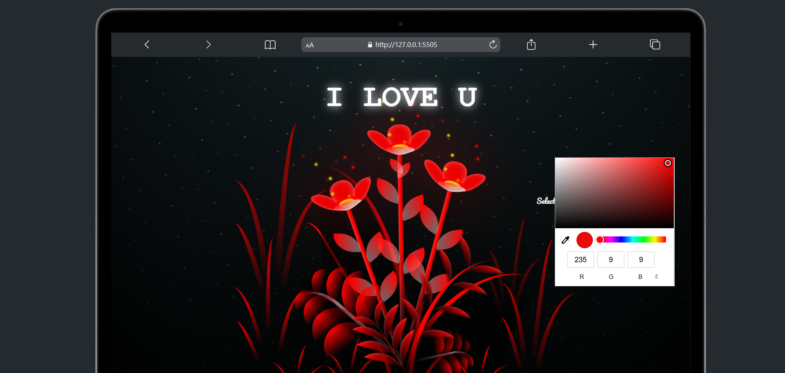

# 🌸 She Likes Flowers? 🌸 

**A Digital Garden Built with Love (and JavaScript)**  
*Where cursor movements bloom into flowers & "I LOVE YOU" animations steal hearts*  

 

---
visit:- https://nick336.github.io/she-loves-flower/ ❤️  

## ✨ Features  
- **Cursor Flower Effect**: Flowers with random colors/sizes appear wherever the cursor moves 🌈  
- **Animated "I LOVE YOU"**: Roses rise from the bottom with a smooth CSS animation 🌹  
- **Custom Color Picker**: Let users choose flower, grass, and background colors 🎨  
- **Forever Bloom**: Flowers stay on the screen until the page is refreshed 🌼  

---

---

## 🌷 How to Use  
1. Move your cursor to paint flowers  
2. Click the "OPEN" button to reveal the surprise message  
3. Use the color pickers to:  
   - Change flower colors 🌻  
   - Adjust grass/background colors 🟢  

---

## 💌 Acknowledgments  
- To every developer who believes code can be romantic 💻❤️  
- CSS-Tricks & MDN Web Docs for animation references  
- *Her* smile, for debugging motivation 😊  

---
 
**⭐ Star this repo if you’d code for someone special!**
